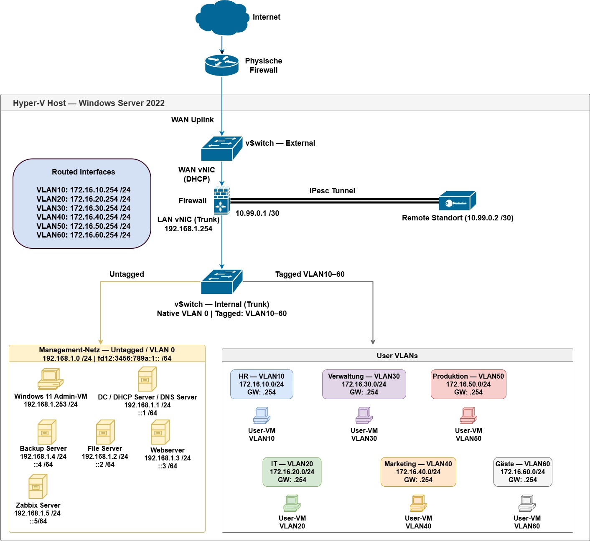

# Aufbau eines virtuellen Netzwerks für ein fiktives, mittelständisches Unternehmen

Dokumentation eines vollständig virtualisierten IT-Infrastruktur-Projekts (Hyper-V, pfSense, Active Directory, VLAN-Segmentierung, Zabbix Monitoring) als Lern- und Testplattform.

## Topologie

## Inhaltsverzeichnis

1. [Projektbeschreibung](docs/01-projektbeschreibung.md)
   - Virtualisierungsplattform
   - Netzwerkkonzept
   - Kernkomponenten
2. [Netzplan](docs/02-netzplan.md)
   - Management-Netz
   - VLAN-Segmentierung / DHCP-Adressierung
   - Routed VLAN Interfaces
   - Topologie
3. [VM-Dokumentation](docs/03-vm-dokumentation.md)
   - Domain Controller
   - Fileserver
   - Webserver
   - Backup-Server
   - Zabbix Monitoring (Ubuntu)
   - Firewall (pfSense)
   - MGMT-PC
4. [Host-Maschine (Hyper-V Host)](docs/04-host-maschine.md)
   - Netzwerk
   - BMC-Zugang
   - Betriebssystem-Konten
5. [Gelernte Konzepte](docs/05-gelernte-konzepte.md)

---
## Autor

**Claudius B.**  
Auszubildender zum Fachinformatiker für Systemintegration
