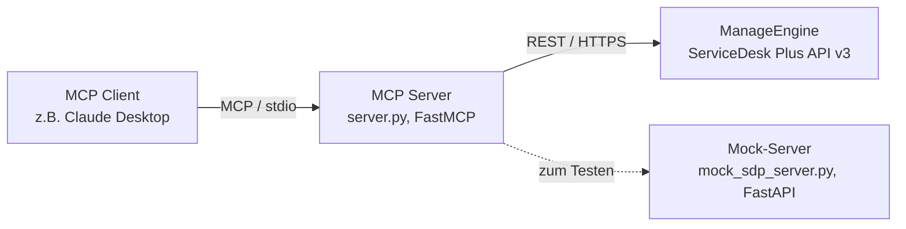

# MCP Server für ManageEngine ServiceDesk Plus
 
> Ausbildungsprojekt: Anbindung eines Ticketsystems (ManageEngine ServiceDesk Plus) an ein LLM über das **Model Context Protocol (MCP)**, gebaut mit [FastMCP](https://gofastmcp.com).
 
[]()
[]()
[](LICENSE)
[]()
 
---
 
## Über dieses Projekt
 
Dieses Repository entstand im Rahmen meiner Ausbildung, um zu lernen, wie man:
 
- ein **MCP (Model Context Protocol)** Server aufbaut, der LLMs wie Claude Zugriff auf externe Systeme gibt,
- eine bestehende REST-API (ManageEngine ServiceDesk Plus) sauber anbindet,
- eigene Test-Infrastruktur (einen API-Mock) baut, um unabhängig vom Produktivsystem entwickeln zu können.
Der Server stellt Tools bereit, mit denen ein LLM Support-Tickets **lesen, anlegen, kommentieren und aktualisieren** kann – ganz ohne dass jemand händisch im ServiceDesk-Plus-Webinterface klicken muss.
 
## Lernziele
 
- [x] Grundlagen von MCP (Tools, Server, Client) verstehen
- [x] Anbindung einer REST-API mit Authentifizierung (Technician API-Key)
- [x] Eigenen API-Mock zum Testen bauen (FastAPI)
- [x] Fehlerbehandlung, statt den Server bei API-Fehlern abstürzen zu lassen
- [ ] Deployment über HTTP-Transport mit OAuth (geplant)
- [ ] Unit-Tests für die Tools ergänzen (geplant)

## Architektur
 

 
Im Entwicklungsbetrieb zeigt der MCP-Server auf den lokalen Mock (`mock_sdp_server.py`), der die relevanten Endpunkte der echten API nachbildet. Für den Produktivbetrieb wird nur die Konfiguration (Umgebungsvariablen) umgestellt – der Code bleibt identisch.
 
## Verzeichnisstruktur
 
```
.
├── server.py              # MCP-Server mit den ServiceDesk-Plus-Tools
├── mock_sdp_server.py      # Lokaler API-Simulator zum Testen ohne Produktivsystem
├── test_client.py          # Einfaches Testskript ohne Node.js/Inspector
├── requirements.txt
├── .env.example
├── .gitignore
├── LICENSE
└── README.md
```
 
## Verfügbare Tools
 
| Tool | Beschreibung | Parameter |
|---|---|---|
| `list_tickets` | Tickets nach Status filtern und auflisten | `status`, `limit`, `start_index` |
| `get_ticket` | Details eines einzelnen Tickets abrufen | `ticket_id` |
| `create_ticket` | Neues Ticket anlegen | `subject`, `description`, `requester_email` |
| `add_note` | Notiz zu einem Ticket hinzufügen | `ticket_id`, `note`, `is_public` |
| `update_ticket_status` | Status eines Tickets ändern | `ticket_id`, `status` |
 
## Setup
 
### Voraussetzungen
 
- Python 3.10+
- Node.js (nur für den MCP Inspector zum interaktiven Testen)
- Zugriff auf eine ManageEngine-ServiceDesk-Plus-Instanz (für den Produktivbetrieb)
### Installation
 
```bash
git clone https://github.com/<dein-username>/<dein-repo>.git
cd <dein-repo>
pip install -r requirements.txt
```
 
### Konfiguration
 
```bash
cp .env.example .env
```
 
`.env` ausfüllen:
 
```env
SDP_BASE_URL=http://127.0.0.1:9000/api/v3   # oder eure echte Instanz
SDP_API_KEY=euer-technician-key
```
 
> ⚠️ `.env` niemals committen – ist bereits in `.gitignore` eingetragen.
 
## Entwicklung & Testen (mit Mock-Server)
 
Statt gegen das echte Ticketsystem zu testen, läuft ein lokaler Simulator mit.
 
**Terminal 1 – Mock-Server starten:**
```bash
uvicorn mock_sdp_server:app --reload --port 9000
```
Swagger-UI zur Kontrolle: http://127.0.0.1:9000/docs
 
**Terminal 2 – MCP-Server testen:**
```bash
export SDP_BASE_URL=http://127.0.0.1:9000/api/v3
export SDP_API_KEY=test123
 
# Variante A: MCP Inspector (Browser, benötigt Node.js)
fastmcp dev inspector server.py
 
# Variante B: einfaches Python-Testskript ohne Node.js
python test_client.py
```
 
## Produktivbetrieb
 
Nur die Umgebungsvariablen austauschen, der Code bleibt gleich:
 
```env
SDP_BASE_URL=https://eure-echte-instanz.example.com/api/v3
SDP_API_KEY=echter-technician-key
```
 
Der Technician-Account hinter dem Key braucht in ServiceDesk Plus Schreibrechte für Requests und Notes, sonst schlagen `create_ticket`, `add_note` und `update_ticket_status` fehl.
 
## Bekannte Einschränkungen
 
- Rate Limits sind bei ManageEngine nicht offiziell dokumentiert – kein Retry/Backoff bisher implementiert.
- Nur Technician-API-Key-Auth abgedeckt, kein OAuth (Cloud-Variante).
- Fehler werden aktuell als `{"error": "..."}` zurückgegeben statt strukturierter Exceptions.
## Roadmap
 
- [ ] Retry/Backoff bei Rate-Limit-Fehlern
- [ ] OAuth-Unterstützung für ServiceDesk Plus Cloud
- [ ] Unit-Tests (pytest) für alle Tools
- [ ] HTTP-Transport + Auth für Team-Nutzung
## Lizenz
 
Dieses Projekt steht unter der [MIT-Lizenz](LICENSE).
 
---
 
*Entstanden als Ausbildungsprojekt zum Thema MCP-Server-Entwicklung und API-Integration.*
